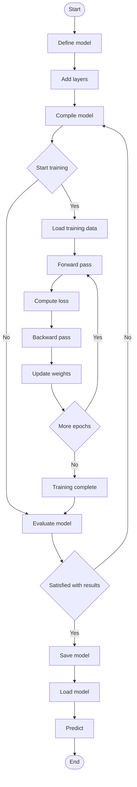

## NNF (Neural Network Framework) – Activity Diagram

```mermaid
flowchart TD
    Start([Start])
    DefineModel[Define model]
    AddLayers[Add layers]
    CompileModel[Compile model]
    StartTraining{Start training}
    LoadData[Load training data]
    ForwardPass[Forward pass]
    ComputeLoss[Compute loss]
    BackwardPass[Backward pass]
    UpdateWeights[Update weights]
    MoreEpochs{More epochs}
    TrainingDone[Training complete]
    Evaluate[Evaluate model]
    Satisfied{Satisfied with results}
    SaveModel[Save model]
    LoadModel[Load model]
    Predict[Predict]
    End([End])

    Start --> DefineModel
    DefineModel --> AddLayers
    AddLayers --> CompileModel
    CompileModel --> StartTraining

    StartTraining -->|Yes| LoadData
    StartTraining -->|No| Evaluate

    LoadData --> ForwardPass
    ForwardPass --> ComputeLoss
    ComputeLoss --> BackwardPass
    BackwardPass --> UpdateWeights
    UpdateWeights --> MoreEpochs

    MoreEpochs -->|Yes| ForwardPass
    MoreEpochs -->|No| TrainingDone

    TrainingDone --> Evaluate
    Evaluate --> Satisfied

    Satisfied -->|No| CompileModel
    Satisfied -->|Yes| SaveModel

    SaveModel --> LoadModel
    LoadModel --> Predict
    Predict --> End
```