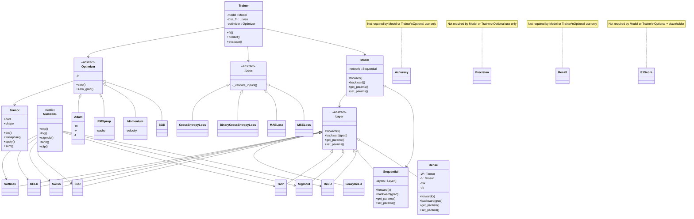

## NNF (Neural Network Framework) – Class Diagram

```mermaid
classDiagram
    %% ===== BASE CORE =====
    class Tensor {
        +data
        +shape
        +dot()
        +transpose()
        +apply()
        +sum()
    }

    class MathUtils {
        <<static>>
        +exp()
        +log()
        +sigmoid()
        +tanh()
        +clip()
    }

    %% ===== LAYERS =====
    class Layer {
        <<abstract>>
        +forward(x)
        +backward(grad)
        +get_params()
        +set_params()
    }

    class Dense {
        -W : Tensor
        -b : Tensor
        -dW
        -db
        +forward(x)
        +backward(grad)
        +get_params()
        +set_params()
    }

    class Sequential {
        -layers : Layer[]
        +forward(x)
        +backward(grad)
        +get_params()
        +set_params()
    }

    Layer <|-- Dense
    Layer <|-- Sequential

    %% ===== ACTIVATIONS =====
    class ReLU
    class Sigmoid
    class Tanh
    class LeakyReLU
    class ELU
    class Swish
    class GELU
    class Softmax

    Layer <|-- ReLU
    Layer <|-- Sigmoid
    Layer <|-- Tanh
    Layer <|-- LeakyReLU
    Layer <|-- ELU
    Layer <|-- Swish
    Layer <|-- GELU
    Layer <|-- Softmax

    MathUtils --> ReLU
    MathUtils --> Sigmoid
    MathUtils --> Tanh
    MathUtils --> ELU
    MathUtils --> Swish
    MathUtils --> GELU
    MathUtils --> Softmax

    %% ===== MODEL =====
    class Model {
        -network : Sequential
        +forward()
        +backward()
        +get_params()
        +set_params()
    }

    Model o--> Sequential
    Model --> Layer

    %% ===== TRAINER =====
    class Trainer {
        -model : Model
        -loss_fn : _Loss
        -optimizer : Optimizer
        +fit()
        +predict()
        +evaluate()
    }

    Trainer --> Model
    Trainer --> _Loss
    Trainer --> Optimizer

    %% ===== LOSSES =====
    class _Loss {
        <<abstract>>
        -_validate_inputs()
    }

    class MSELoss
    class MAELoss
    class BinaryCrossEntropyLoss
    class CrossEntropyLoss

    _Loss <|-- MSELoss
    _Loss <|-- MAELoss
    _Loss <|-- BinaryCrossEntropyLoss
    _Loss <|-- CrossEntropyLoss

    %% ===== OPTIMIZERS =====
    class Optimizer {
        <<abstract>>
        -lr
        +step()
        +zero_grad()
    }

    class SGD
    class Momentum {
        -velocity
    }
    class RMSprop {
        -cache
    }
    class Adam {
        -m
        -v
        -t
    }

    Optimizer <|-- SGD
    Optimizer <|-- Momentum
    Optimizer <|-- RMSprop
    Optimizer <|-- Adam
    Optimizer --> Tensor

    %% ===== METRICS (OPTIONAL) =====
    class Accuracy
    class Precision
    class Recall
    class F1Score

    %% Optional Notes
    note for Accuracy "Not required by Model or Trainer\nOptional use only"
    note for Precision "Not required by Model or Trainer\nOptional use only"
    note for Recall "Not required by Model or Trainer\nOptional use only"
    note for F1Score "Not required by Model or Trainer\nOptional + placeholder"
```