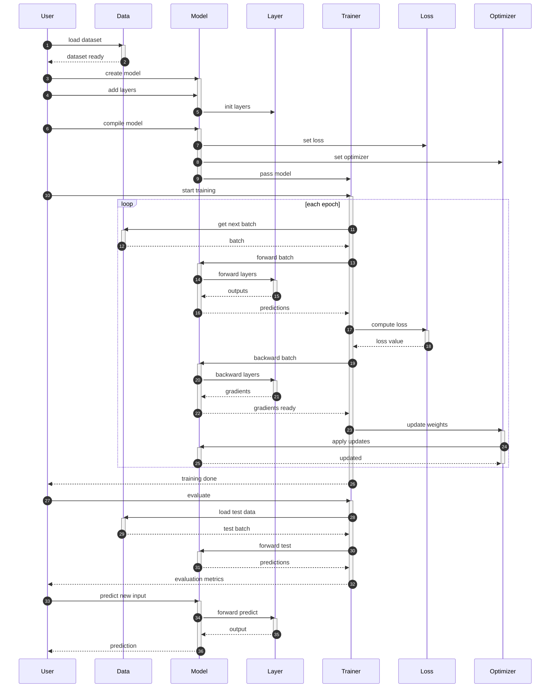

## NNF (Neural Network Framework) – Sequence Diagram

```mermaid
sequenceDiagram
    autonumber

    participant User
    participant Data
    participant Model
    participant Layer
    participant Trainer
    participant Loss
    participant Optimizer

    User ->> Data: load dataset
    activate Data
    Data -->> User: dataset ready
    deactivate Data

    User ->> Model: create model
    activate Model
    User ->> Model: add layers
    Model ->> Layer: init layers
    deactivate Model

    User ->> Model: compile model
    activate Model
    Model ->> Loss: set loss
    Model ->> Optimizer: set optimizer
    Model ->> Trainer: pass model
    deactivate Model

    User ->> Trainer: start training
    activate Trainer

    loop each epoch
        Trainer ->> Data: get next batch
        activate Data
        Data -->> Trainer: batch
        deactivate Data

        Trainer ->> Model: forward batch
        activate Model
        Model ->> Layer: forward layers
        activate Layer
        Layer -->> Model: outputs
        deactivate Layer
        Model -->> Trainer: predictions
        deactivate Model

        Trainer ->> Loss: compute loss
        activate Loss
        Loss -->> Trainer: loss value
        deactivate Loss

        Trainer ->> Model: backward batch
        activate Model
        Model ->> Layer: backward layers
        activate Layer
        Layer -->> Model: gradients
        deactivate Layer
        Model -->> Trainer: gradients ready
        deactivate Model

        Trainer ->> Optimizer: update weights
        activate Optimizer
        Optimizer ->> Model: apply updates
        activate Model
        Model -->> Optimizer: updated
        deactivate Model
        deactivate Optimizer
    end

    Trainer -->> User: training done
    deactivate Trainer

    User ->> Trainer: evaluate
    activate Trainer
    Trainer ->> Data: load test data
    activate Data
    Data -->> Trainer: test batch
    deactivate Data

    Trainer ->> Model: forward test
    activate Model
    Model -->> Trainer: predictions
    deactivate Model

    Trainer -->> User: evaluation metrics
    deactivate Trainer

    User ->> Model: predict new input
    activate Model
    Model ->> Layer: forward predict
    activate Layer
    Layer -->> Model: output
    deactivate Layer
    Model -->> User: prediction
    deactivate Model
```