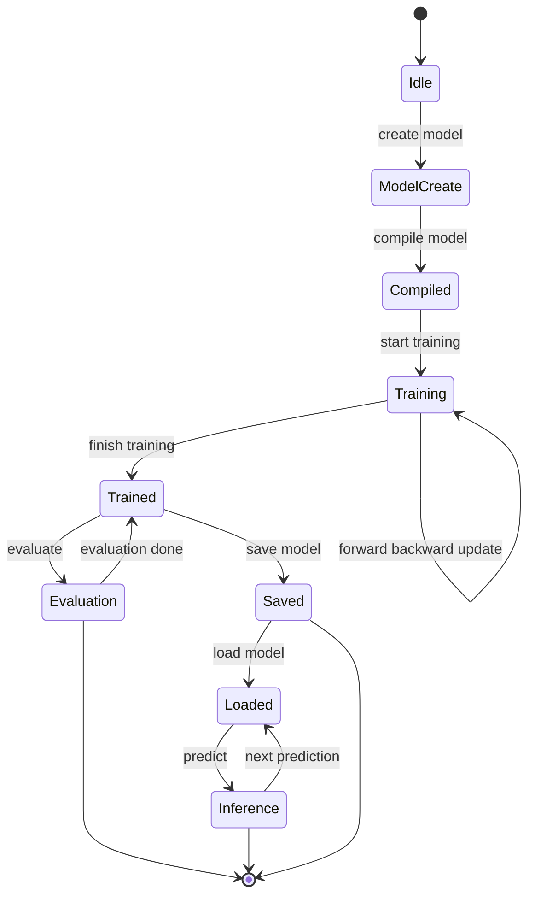

```mermaid
stateDiagram-v2
    [*] --> Idle

    Idle --> ModelCreate: create model
    ModelCreate --> Compiled: compile model

    Compiled --> Training: start training
    Training --> Training: forward backward update
    Training --> Trained: finish training

    Trained --> Evaluation: evaluate
    Evaluation --> Trained: evaluation done

    Trained --> Saved: save model
    Saved --> Loaded: load model

    Loaded --> Inference: predict
    Inference --> Loaded: next prediction

    Evaluation --> [*]
    Inference --> [*]
    Saved --> [*]
```