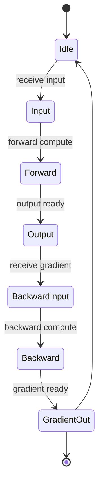

```mermaid
stateDiagram-v2
    [*] --> Idle

    Idle --> Input: receive input
    Input --> Forward: forward compute
    Forward --> Output: output ready

    Output --> BackwardInput: receive gradient
    BackwardInput --> Backward: backward compute
    Backward --> GradientOut: gradient ready

    GradientOut --> Idle

    GradientOut --> [*]
```