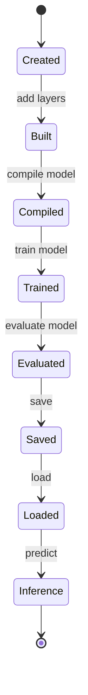

## NNF (Neural Network Framework) – State Machine Diagram (Model Lifecycle)

```mermaid
stateDiagram-v2
    [*] --> Created

    Created --> Built: add layers
    Built --> Compiled: compile model
    Compiled --> Trained: train model
    Trained --> Evaluated: evaluate model
    Evaluated --> Saved: save
    Saved --> Loaded: load
    Loaded --> Inference: predict

    Inference --> [*]
```