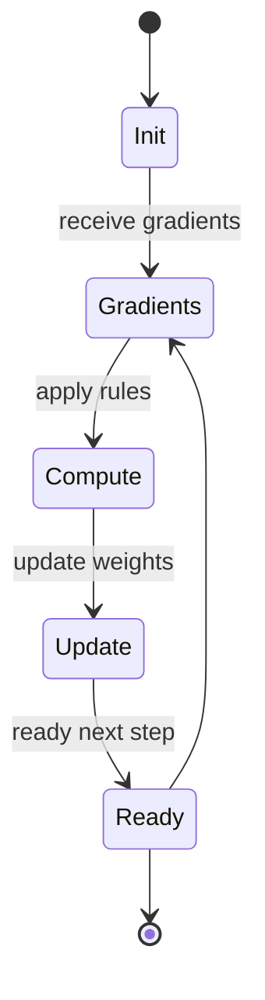

## NNF (Neural Network Framework) – State Machine Diagram (Optimizer)

```mermaid
stateDiagram-v2
    [*] --> Init

    Init --> Gradients: receive gradients
    Gradients --> Compute: apply rules
    Compute --> Update: update weights
    Update --> Ready: ready next step

    Ready --> Gradients

    Ready --> [*]
```