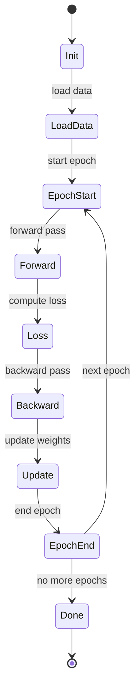

## NNF (Neural Network Framework) – State Machine Diagram (Training Process)

```mermaid
stateDiagram-v2
    [*] --> Init

    Init --> LoadData: load data
    LoadData --> EpochStart: start epoch
    EpochStart --> Forward: forward pass
    Forward --> Loss: compute loss
    Loss --> Backward: backward pass
    Backward --> Update: update weights
    Update --> EpochEnd: end epoch

    EpochEnd --> EpochStart: next epoch
    EpochEnd --> Done: no more epochs

    Done --> [*]
```