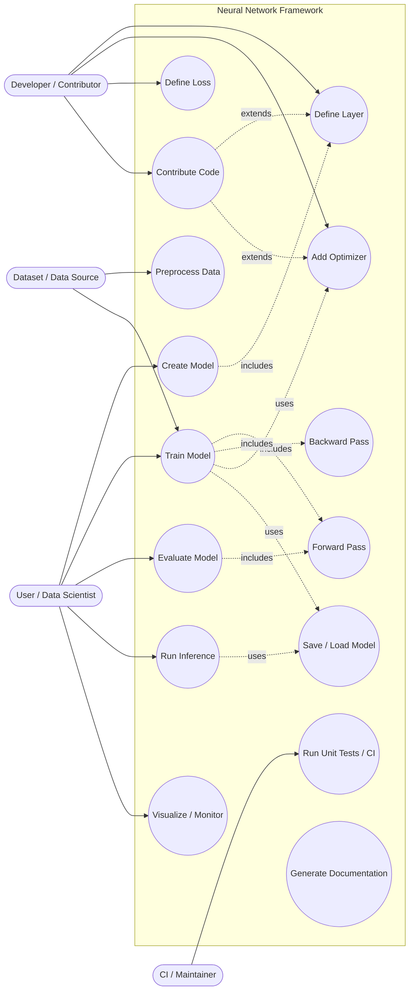

## NNF (Neural Network Framework) – Use Case Diagram

```mermaid
flowchart LR
  %% Direction: Left to Right
  %% Actors
  User(["User / Data Scientist"])
  Dev(["Developer / Contributor"])
  Data(["Dataset / Data Source"])
  CI(["CI / Maintainer"])

  subgraph NNFramework["Neural Network Framework"]
    UC_Create(("Create Model"))
    UC_Layer(("Define Layer"))
    UC_Opt(("Add Optimizer"))
    UC_Loss(("Define Loss"))
    UC_Fwd(("Forward Pass"))
    UC_Bwd(("Backward Pass"))
    UC_Train(("Train Model"))
    UC_Eval(("Evaluate Model"))
    UC_Save(("Save / Load Model"))
    UC_Infer(("Run Inference"))
    UC_Data(("Preprocess Data"))
    UC_Monitor(("Visualize / Monitor"))
    UC_Contrib(("Contribute Code"))
    UC_CI(("Run Unit Tests / CI"))
    UC_Doc(("Generate Documentation"))
  end

  %% Actor connections
  User --> UC_Create
  User --> UC_Train
  User --> UC_Eval
  User --> UC_Infer
  User --> UC_Monitor

  Data --> UC_Data
  Data --> UC_Train

  Dev --> UC_Layer
  Dev --> UC_Opt
  Dev --> UC_Loss
  Dev --> UC_Contrib

  CI --> UC_CI

  %% Relationships (dotted lines for includes / extends)
  UC_Train -.->|includes| UC_Fwd
  UC_Train -.->|includes| UC_Bwd
  UC_Train -.->|uses| UC_Opt
  UC_Eval -.->|includes| UC_Fwd
  UC_Create -.->|includes| UC_Layer
  UC_Infer -.->|uses| UC_Save
  UC_Train -.->|uses| UC_Save
  UC_Contrib -.->|extends| UC_Layer
  UC_Contrib -.->|extends| UC_Opt
```